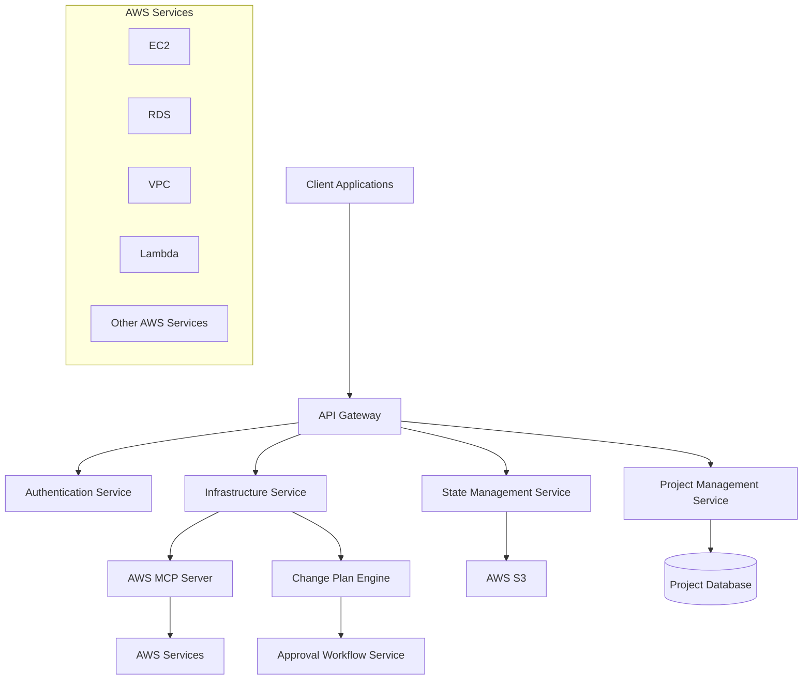

# Design Document

## Overview

AWS 인프라스트럭처 관리 서비스는 마이크로서비스 아키텍처를 기반으로 하며, AWS MCP 서버를 통해 AWS 리소스를 관리하고 S3를 통해 프로젝트별 상태를 저장하는 시스템입니다. 시스템은 RESTful API를 제공하며, 변경 계획 생성 및 승인 워크플로우를 통해 안전한 인프라스트럭처 관리를 지원합니다.

## Architecture

### High-Level Architecture



### Service Architecture

시스템은 다음과 같은 주요 서비스로 구성됩니다:

1. **API Gateway**: 모든 클라이언트 요청의 진입점
2. **Infrastructure Service**: AWS 리소스 CRUD 작업 관리
3. **State Management Service**: S3 기반 상태 파일 관리
4. **Project Management Service**: 프로젝트별 컨텍스트 관리
5. **Change Plan Engine**: 변경 계획 생성 및 분석
6. **Approval Workflow Service**: 변경 승인 프로세스 관리

## Components and Interfaces

### 1. Infrastructure Service

**책임**: AWS MCP 서버를 통한 리소스 관리

**주요 인터페이스**:
```python
from abc import ABC, abstractmethod
from typing import List, Optional, Dict, Any
from dataclasses import dataclass
from datetime import datetime
from enum import Enum

class InfrastructureService(ABC):
    @abstractmethod
    async def create_resource(self, project_id: str, resource_config: 'ResourceConfig') -> 'Resource':
        pass
    
    @abstractmethod
    async def get_resources(self, project_id: str, filters: Optional['ResourceFilter'] = None) -> List['Resource']:
        pass
    
    @abstractmethod
    async def update_resource(self, project_id: str, resource_id: str, updates: 'ResourceUpdate') -> 'Resource':
        pass
    
    @abstractmethod
    async def delete_resource(self, project_id: str, resource_id: str) -> None:
        pass
    
    @abstractmethod
    async def generate_change_plan(self, project_id: str, desired_state: 'InfrastructureState') -> 'ChangePlan':
        pass

@dataclass
class ResourceConfig:
    type: str
    name: str
    properties: Dict[str, Any]
    tags: Optional[Dict[str, str]] = None

class ChangePlanStatus(Enum):
    PENDING = "pending"
    APPROVED = "approved"
    REJECTED = "rejected"
    EXECUTED = "executed"

@dataclass
class ChangePlan:
    id: str
    project_id: str
    summary: 'ChangeSummary'
    changes: List['Change']
    created_at: datetime
    status: ChangePlanStatus
```

### 2. State Management Service

**책임**: S3를 통한 프로젝트별 상태 파일 관리

**주요 인터페이스**:
```python
class StateManagementService(ABC):
    @abstractmethod
    async def get_current_state(self, project_id: str) -> Optional['InfrastructureState']:
        pass
    
    @abstractmethod
    async def save_state(self, project_id: str, state: 'InfrastructureState') -> None:
        pass
    
    @abstractmethod
    async def get_state_history(self, project_id: str, limit: Optional[int] = None) -> List['StateSnapshot']:
        pass
    
    @abstractmethod
    def compare_states(self, current_state: 'InfrastructureState', desired_state: 'InfrastructureState') -> 'ChangePlan':
        pass

@dataclass
class InfrastructureState:
    project_id: str
    version: str
    timestamp: datetime
    resources: List['Resource']
    metadata: 'StateMetadata'

@dataclass
class StateSnapshot:
    version: str
    timestamp: datetime
    change_description: str
    s3_location: str
```

### 3. Project Management Service

**책임**: 프로젝트 컨텍스트 및 권한 관리

**주요 인터페이스**:
```python
class ProjectManagementService(ABC):
    @abstractmethod
    async def create_project(self, project: 'ProjectConfig') -> 'Project':
        pass
    
    @abstractmethod
    async def get_project(self, project_id: str) -> 'Project':
        pass
    
    @abstractmethod
    async def list_projects(self, user_id: str) -> List['Project']:
        pass
    
    @abstractmethod
    async def update_project(self, project_id: str, updates: 'ProjectUpdate') -> 'Project':
        pass
    
    @abstractmethod
    async def delete_project(self, project_id: str) -> None:
        pass
    
    @abstractmethod
    async def validate_project_access(self, user_id: str, project_id: str) -> bool:
        pass

@dataclass
class Project:
    id: str
    name: str
    description: str
    owner: str
    members: List['ProjectMember']
    settings: 'ProjectSettings'
    created_at: datetime
    updated_at: datetime

@dataclass
class ProjectSettings:
    s3_bucket_path: str
    default_region: str
    auto_approval_rules: Optional[List['ApprovalRule']] = None
    notification_settings: Optional['NotificationConfig'] = None
```

### 4. Change Plan Engine

**책임**: 인프라스트럭처 변경 계획 생성 및 분석

**주요 인터페이스**:
```python
class ChangeAction(Enum):
    CREATE = "create"
    UPDATE = "update"
    DELETE = "delete"

class RiskLevel(Enum):
    LOW = "low"
    MEDIUM = "medium"
    HIGH = "high"

class ChangePlanEngine(ABC):
    @abstractmethod
    async def generate_plan(self, project_id: str, desired_state: 'InfrastructureState') -> 'ChangePlan':
        pass
    
    @abstractmethod
    async def analyze_dependencies(self, changes: List['Change']) -> 'DependencyGraph':
        pass
    
    @abstractmethod
    async def estimate_cost(self, change_plan: 'ChangePlan') -> 'CostEstimate':
        pass
    
    @abstractmethod
    async def validate_plan(self, change_plan: 'ChangePlan') -> 'ValidationResult':
        pass

@dataclass
class Change:
    action: ChangeAction
    resource_type: str
    resource_id: str
    current_config: Optional['ResourceConfig'] = None
    desired_config: Optional['ResourceConfig'] = None
    dependencies: List[str] = None
    risk_level: RiskLevel = RiskLevel.LOW
    
    def __post_init__(self):
        if self.dependencies is None:
            self.dependencies = []
```

## Data Models

### Resource Model
```python
class ResourceStatus(Enum):
    CREATING = "creating"
    ACTIVE = "active"
    UPDATING = "updating"
    DELETING = "deleting"
    ERROR = "error"

@dataclass
class Resource:
    id: str
    project_id: str
    type: str
    name: str
    region: str
    properties: Dict[str, Any]
    tags: Dict[str, str]
    status: ResourceStatus
    created_at: datetime
    updated_at: datetime
    arn: Optional[str] = None
```

### State File Structure (S3)
```json
{
  "version": "1.0.0",
  "projectId": "project-123",
  "timestamp": "2024-01-15T10:30:00Z",
  "metadata": {
    "lastModifiedBy": "user@example.com",
    "changeDescription": "Added RDS instance",
    "changePlanId": "plan-456"
  },
  "resources": [
    {
      "id": "i-1234567890abcdef0",
      "type": "EC2::Instance",
      "name": "web-server-1",
      "arn": "arn:aws:ec2:us-east-1:123456789012:instance/i-1234567890abcdef0",
      "region": "us-east-1",
      "properties": {
        "instanceType": "t3.micro",
        "imageId": "ami-12345678",
        "subnetId": "subnet-12345678"
      },
      "tags": {
        "Environment": "production",
        "Project": "web-app"
      },
      "status": "active",
      "createdAt": "2024-01-15T10:00:00Z",
      "updatedAt": "2024-01-15T10:00:00Z"
    }
  ]
}
```

## Error Handling

### Error Categories

1. **AWS MCP Server Errors**: AWS API 호출 실패, 권한 부족, 리소스 제한
2. **State Management Errors**: S3 접근 실패, 상태 파일 손상, 버전 충돌
3. **Validation Errors**: 잘못된 리소스 구성, 의존성 오류, 정책 위반
4. **Business Logic Errors**: 프로젝트 권한 부족, 승인 프로세스 오류

### Error Handling Strategy

```python
@dataclass
class ErrorResponse:
    code: str
    message: str
    timestamp: datetime
    request_id: str
    details: Optional[Dict[str, Any]] = None

class ErrorCodes(Enum):
    AWS_MCP_CONNECTION_FAILED = 'AWS_MCP_001'
    RESOURCE_NOT_FOUND = 'RESOURCE_001'
    INSUFFICIENT_PERMISSIONS = 'AUTH_001'
    STATE_FILE_CORRUPTED = 'STATE_001'
    VALIDATION_FAILED = 'VALIDATION_001'
    APPROVAL_TIMEOUT = 'APPROVAL_001'

class InfrastructureException(Exception):
    def __init__(self, code: ErrorCodes, message: str, details: Optional[Dict[str, Any]] = None):
        self.code = code
        self.message = message
        self.details = details or {}
        self.timestamp = datetime.now()
        super().__init__(message)
```

### Retry and Circuit Breaker

- AWS MCP 서버 호출에 대한 지수 백오프 재시도
- S3 작업에 대한 회로 차단기 패턴 적용
- 상태 파일 손상 시 백업에서 복구

## Testing Strategy

### Unit Testing
- 각 서비스의 비즈니스 로직 테스트
- Mock을 사용한 외부 의존성 격리
- 에러 처리 시나리오 테스트

### Integration Testing
- AWS MCP 서버와의 통합 테스트
- S3 상태 관리 통합 테스트
- 프로젝트별 격리 테스트

### End-to-End Testing
- 전체 워크플로우 테스트 (생성 → 변경 계획 → 승인 → 실행)
- 프로젝트 간 격리 검증
- 상태 일관성 테스트

### Performance Testing
- 대량 리소스 처리 성능 테스트
- 동시 프로젝트 작업 처리 테스트
- S3 상태 파일 크기별 성능 테스트

### Security Testing
- 프로젝트별 권한 격리 테스트
- AWS 자격 증명 보안 테스트
- API 인증/인가 테스트